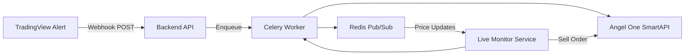

# Automated Trading System with TradingView & Angel One Integration

> **Note:** Full source code is proprietary under the Softwired Internship and is not publicly shared.

---

## Table of Contents

- [Overview](#overview)  
- [Workflow & Strategy Development](#workflow--strategy-development)  
- [TradingView Integration](#tradingview-integration)  
- [Backend Architecture](#backend-architecture)  
  - [Broker (Angel One) Integration](#broker-angel-one-integration)  
  - [User & Account Management](#user--account-management)  
  - [Webhook Link Configuration](#webhook-link-configuration)  
  - [Paper Trading Mode](#paper-trading-mode)  
- [Live Monitoring & Order Execution](#live-monitoring--order-execution)  
  - [WebSocket & Redis Price Feed](#websocket--redis-price-feed)  
  - [Subscription Lifecycle](#subscription-lifecycle)  
  - [Sell Conditions & Edge Cases](#sell-conditions--edge-cases)  
  - [Bot Control (Start/Stop)](#bot-control-startstop)  
- [Scheduling & End-of-Day Logic](#scheduling--end-of-day-logic)  
- [Web Dashboard Features](#web-dashboard-features)  
- [Tech Stack](#tech-stack)  
- [Setup & Installation](#setup--installation)  
- [Configuration & Environment Variables](#configuration--environment-variables)  
- [Running Locally](#running-locally)  
- [Testing](#testing)  
- [Deployment on AWS](#deployment-on-aws)  
- [Project Structure](#project-structure)  
- [License](#license)  

---

## Overview

This project implements a fully automated trading system that:

1. **Develops and backtests** custom stock-market strategies in Pine Script on TradingView.  
2. **Generates webhook alerts** for buy/sell signals (Put/Call).  
3. **Receives alerts** via a secure backend, routes them to Celery for async processing.  
4. **Executes orders** live on Angel One (via SmartAPI) or in “paper trading” mode for testing.  
5. **Monitors positions** in real time using WebSocket and Redis.  
6. **Handles sell logic** (stop-loss, target, trailing stop, end-of-day exit) with robust edge-case coverage.  
7. **Provides a React dashboard** for management, history, and control (start/stop bot).  
8. **Deploys** the entire stack on AWS EC2 with NGINX, systemd, and environment-based secrets.

---

## Workflow & Strategy Development

1. **Strategy Creation & Analysis**  
   - Define technical indicators, entry/exit rules in Pine Script.  
   - Backtest across multiple timeframes (2 min, 5 min, etc.) to evaluate P&L, drawdowns.  

2. **Pine Script Alerts**  
   - Embed `alertcondition()` calls for Put/Call buy signals.  
   - Customize alert message format (JSON payload) including:  
     ```json
     {
       "strategy": "MySuperTrend",
       "symbol": "RELIANCE",
       "action": "BUY_CALL",
       "timestamp": "{{timenow}}"
     }
     ```
   - Enable TradingView’s webhook URL feature to POST alerts to your backend.

---

## TradingView Integration

- **Webhook Configuration**  
  - Paste your backend’s “Webhook Link” URL into TradingView alert dialog.  
  - Ensure payload matches your backend’s expected JSON schema.  

- **Strategy Filtering**  
  - Multiple strategies may fire alerts simultaneously.  
  - Each “Webhook Link” is tied to a specific strategy name.  
  - Backend ignores alerts whose `strategy` field does not match the configured link.

---

## Backend Architecture



### Broker (Angel One) Integration

- **SmartAPI Credentials**  
  - **Client ID**  
  - **API Key**  
  - **Password**  
  - **TOTP Token**  
- Securely stored and rotated via Celery tasks.

### User & Account Management

- **User Fields:**  
  | Field       | Description             |
  |-------------|-------------------------|
  | Username    | Unique login ID         |
  | Password    | Hashed via Django       |
  | First Name  | User’s first name       |
  | Last Name   | User’s last name        |
- **Account Linking:**  
  - One user → One or more Angel One accounts.  
  - Each account holds its own SmartAPI credentials.

### Webhook Link Configuration

| Field                   | Description                                                        |
|-------------------------|--------------------------------------------------------------------|
| **Name**                | Friendly identifier (e.g., “ST Trend Bot”)                         |
| **Account**             | Select from linked Angel One accounts                              |
| **Strategy**            | Strategy name (matches `strategy` in Pine Script alert payload)    |
| **Stop-Loss (%)**       | Maximum allowable loss per trade                                   |
| **Target (%)**          | Profit target per trade                                            |
| **Trailing Stop (%)**   | Dynamic exit buffer                                               |
| **Paper Trading**       | ☑️ Enable simulated orders (no real broker calls)                  |

### Paper Trading Mode

- **Simulation Only:**  
  - Orders are **calculated** and **logged**, but **not** sent to Angel One.  
  - Allows beginners to test strategies without capital risk.

---

## Live Monitoring & Order Execution

### WebSocket & Redis Price Feed

- **WebSocket Client** subscribes to live market data (exchange feed).  
- **Redis Pub/Sub** broadcasts price updates to monitoring services.

### Subscription Lifecycle

1. **On Buy Execution:**  
   - Subscribe to symbol’s price channel.  
2. **Continuous Monitoring:**  
   - Evaluate stop-loss/target/trailing conditions on each tick.  
3. **On Sell Execution or Bot Stop:**  
   - Unsubscribe from symbol to free resources.

### Sell Conditions & Edge Cases

- **Stop-Loss:** Immediate market sell when price ≤ entry × (1 – SL%).  
- **Target:** Market sell when price ≥ entry × (1 + Target%).  
- **Trailing Stop:** Adjust stop-loss upward as price moves in favor.  
- **Edge Cases:**  
  - **Flash crashes** (price gap)  
  - **Re-quotes** or **order rejections**  
  - **Partial fills** (track remaining quantity)  
  - **API downtime** (retry logic)

### Bot Control (Start/Stop)

- **Stop Bot:**  
  - Completes all **pending** orders.  
  - **Ignores** new incoming alerts until restarted.  
- **Start Bot:**  
  - Resumes processing of fresh alerts.

---

## Scheduling & End-of-Day Logic

- **Order List JSON Generation**  
  - Daily Cron (via Celery Beat) compiles JSON of all open positions:  
    ```json
    [
      {"symbol": "RELIANCE", "expiry": "2025-05-08", "strike": 2450},
      …
    ]
    ```
- **3:29 PM Close Routine**  
  - Market closes at 3:30 PM IST.  
  - At 3:29 PM, check all open positions:  
    - If **in profit**, keep overnight.  
    - If **not in profit**, force-sell to cut losses.

---

## Web Dashboard Features

- **Dashboard Views:**  
  - **Active Orders** (live & paper)  
  - **Order History** (with Download & Delete options)  
  - **Account & Credential Management**  
  - **Webhook Links** (CRUD)  
  - **Bot Status** (Start/Stop toggle)  
  - **System Logs** (task outcomes, errors)

---

## Tech Stack

| Layer        | Technology                                  |
|--------------|----------------------------------------------|
| Front-End    | React, Vite, Axios, React Router             |
| Back-End     | Django REST Framework, Celery, Redis         |
| Broker API   | Angel One SmartAPI                           |
| Data Store   | SQLite (dev), Redis (cache & pub/sub)        |
| Hosting      | AWS EC2 (Ubuntu), NGINX, systemd             |
| CI/CD        | Git (private repo), GitHub Actions (optional)|

---

## Setup & Installation

1. **Clone Repo**  
   ```bash
   git clone <private-repo-url>
   cd automated-trading-system
   ```

2. **Backend**  
   ```bash
   cd backend/
   python3 -m venv venv
   source venv/bin/activate
   pip install -r requirements.txt
   ```

3. **Frontend**  
   ```bash
   cd ../frontend/
   npm install
   ```

---

## Configuration & Environment Variables

### Backend (`backend/.env`)

```dotenv
SECRET_KEY=…
TRADING_MODE=paper       # or live
BROKER_CLIENT_ID=…
BROKER_API_KEY=…
BROKER_PASSWORD=…
BROKER_TOTP_SECRET=…
REDIS_URL=redis://localhost:6379/0
```

### Frontend (`frontend/.env`)

```dotenv
VITE_BACKEND_URL=http://localhost:8000
```

---

## Running Locally

```bash
# Start Redis
redis-server

# Backend
cd backend/
python manage.py migrate
python manage.py runserver
celery -A backend worker --loglevel=info &
celery -A backend beat --loglevel=info &

# Frontend
cd ../frontend/
npm run dev
```

---

## Testing

- **Backend Tests**  
  ```bash
  cd backend/
  pytest
  ```
- **Frontend Tests**  
  ```bash
  cd frontend/
  npm run test
  ```

---

## Deployment on AWS

1. **Provision EC2 (Ubuntu)**  
2. **Install Dependencies** (Python, Node.js, Redis, NGINX)  
3. **Clone & Build** the repo  
4. **Configure NGINX** reverse proxy to serve React and Django  
5. **Create systemd services** for:  
   - `gunicorn` (Django)  
   - `celery-worker` & `celery-beat`  
   - `react-app` (if built)  
6. **Environment Variables** via `/etc/profile.d/` or AWS Secrets Manager  
7. **Enable & Start** services  
8. **Open Ports** (80, 443 for HTTPS)

---

## Project Structure

```
/
├── backend/
│   ├── backend/          # Django project
│   ├── users/            # User & auth
│   ├── broker/           # Angel One SmartAPI integration
│   ├── strategies/       # Webhook & tasks
│   ├── celery.py
│   ├── manage.py
│   └── requirements.txt
└── frontend/
    ├── public/
    ├── src/              # React app
    ├── vite.config.js
    └── package.json
```

---

## License

Proprietary—developed under **Softwired Internship**. Redistribution or disclosure of code is restricted.
