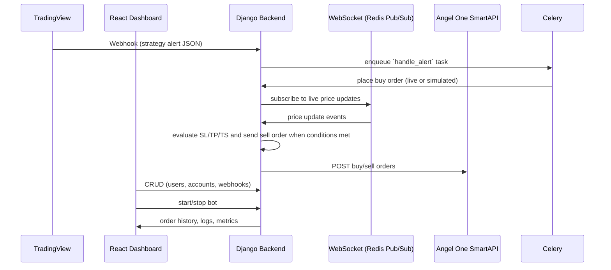
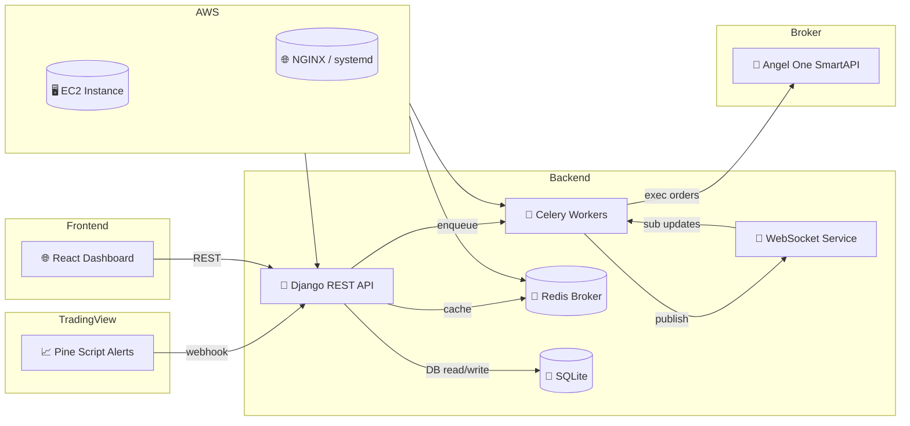

Here’s a **super, extremely detailed** `README.md` that captures every part of your end-to-end system—from strategy design in TradingView through live order execution on Angel One and paper trading, all the way to AWS deployment.

---

# Automated Trading System  
*Integrating TradingView Pine-Script Strategies → Custom Backend → Angel One (SmartAPI) Broker*  

> ⚠️ **Confidential (Softwired Internship)**  
> Full source code is not publicly shared.  

---

## Table of Contents

1. [Project Overview](#project-overview)  
2. [High-Level Workflow](#high-level-workflow)  
3. [Core Features](#core-features)  
4. [Architecture & Components](#architecture--components)  
5. [Technology Stack](#technology-stack)  
6. [Setup & Installation](#setup--installation)  
7. [Environment Configuration](#environment-configuration)  
8. [Detailed Usage Guide](#detailed-usage-guide)  
   1. [1. Strategy Creation & Alerts (TradingView)](#1-strategy-creation--alerts-tradingview)  
   2. [2. Webhook Link Configuration (Your Platform)](#2-webhook-link-configuration-your-platform)  
   3. [3. Live Order Execution & Monitoring](#3-live-order-execution--monitoring)  
   4. [4. Paper-Trading Mode](#4-paper-trading-mode)  
   5. [5. Order History & Management](#5-order-history--management)  
   6. [6. Bot Control (Start/Stop)](#6-bot-control-startstop)  
9. [Testing](#testing)  
10. [Deployment on AWS](#deployment-on-aws)  
11. [Security Considerations](#security-considerations)  
12. [License](#license)  

---

## Project Overview

You’ve built an **end-to-end automated trading system** that:

1. **Analyzes** the stock market with your custom strategy.  
2. **Implements** it in Pine Script on TradingView to generate buy/sell alerts.  
3. **Sends** those alerts via webhook to your backend.  
4. **Executes** orders (live or paper) on Angel One through their SmartAPI.  
5. **Monitors** live prices over WebSocket + Redis to handle stop-loss, targets, and trailing stops.  
6. **Manages** everything via a React dashboard.  
7. **Scales** reliably on AWS EC2 with systemd, NGINX, Redis, Celery, and Django.

---

## High-Level Workflow



---

## Core Features

- **Strategy → Pine Script**  
  - Design any technical/statistical strategy for 2-min, 5-min, etc.  
  - Add `alertcondition()` for PUT/CALL buy signals.  
  - Configure custom JSON-formatted alert messages.

- **Webhook Integration**  
  - Paste generated webhook URL into TradingView.  
  - Receive actionable JSON payloads in Django.

- **Broker Connectivity (Angel One SmartAPI)**  
  - Credentials:  
    - `Smart API Client ID`  
    - `API Key`  
    - `Password`  
    - `TOTP Token`  
  - Automatic token refresh & error handling.

- **User & Account Management**  
  - Create users: `Username`, `Password`, `First Name`, `Last Name`.  
  - Link multiple Angel One accounts per user.  

- **Webhook Link Config**  
  - Define for each link:  
    - `Name`  
    - `Account` (dropdown)  
    - `Strategy` (dropdown)  
    - `Stop-loss %`, `Target %`, `Trailing Stop %`  
    - Paper Trading toggle  

- **Live Monitoring & Order Logic**  
  - Fetch live price via WebSocket & Redis Pub/Sub.  
  - Subscribe on buy, unsubscribe on sell.  
  - Compute SL/TP/TS in real time; auto-sell when hit.

- **Paper Trading Mode**  
  - Simulated P&L and order lifecycle without calling broker API.  
  - Ideal for strategy back-testing and onboarding beginners.

- **Bot Control**  
  - **Start Bot**: begin accepting new alerts.  
  - **Stop Bot**: finish pending orders, ignore new alerts.  

- **Order History & Reports**  
  - View, download (CSV/JSON), or delete past orders.  
  - Detailed logs of each action, timestamps, and execution results.

---

## Architecture & Components



---

## Technology Stack

| Layer        | Component                    |
|--------------|------------------------------|
| **Front-End**| React, Vite, Axios, React Router, JWT |
| **Back-End** | Django, Django REST Framework, Celery, Redis |
| **Broker API** | Angel One SmartAPI         |
| **Real-Time**| WebSocket (Django Channels or custom), Redis Pub/Sub |
| **Database** | SQLite (dev), Redis (cache & broker) |
| **Deployment**| AWS EC2, NGINX, systemd, Git |

---

## Setup & Installation

1. **Clone the repo**  
   ```bash
   git clone <private-repo-url>
   cd automated-trading-system
   ```

2. **Backend**  
   ```bash
   cd backend/
   python3 -m venv venv
   source venv/bin/activate
   pip install --upgrade pip
   pip install -r requirements.txt
   ```

3. **Frontend**  
   ```bash
   cd ../frontend/
   npm install
   ```

4. **Start Local Services**  
   ```bash
   # Terminal 1: Redis
   redis-server

   # Terminal 2: Django + Migrations
   cd backend/
   python manage.py migrate
   python manage.py createsuperuser  # if needed
   python manage.py runserver

   # Terminal 3: Celery & Beat
   cd backend/
   celery -A backend worker --loglevel=info
   celery -A backend beat  --loglevel=info

   # Terminal 4: React Dev Server
   cd ../frontend/
   npm run dev
   ```
   - Backend API at `http://localhost:8000/`  
   - Frontend at `http://localhost:5173/`

---

## Environment Configuration

### `backend/.env`
```dotenv
# Django
SECRET_KEY=<your-django-secret>

# Broker (Angel One SmartAPI)
SMARTAPI_CLIENT_ID=<your-client-id>
SMARTAPI_API_KEY=<your-api-key>
SMARTAPI_PASSWORD=<your-password>
SMARTAPI_TOTP=<your-totp-secret>

# Redis
REDIS_URL=redis://localhost:6379/0

# Trading Mode
TRADING_MODE=live   # or 'paper'
```

### `frontend/.env`
```dotenv
VITE_BACKEND_URL=http://localhost:8000
```

---

## Detailed Usage Guide

### 1. Strategy Creation & Alerts (TradingView)

1. Write your strategy in Pine Script, e.g. on a 2-min or 5-min chart.  
2. Add `alertcondition()` calls for **PUT/CALL** buy signals.  
3. Define your **JSON alert format** under Alerts → Create Alert → “Webhook URL” + “Message” fields.  
4. Paste your platform’s generated webhook URL (see below) into the “Webhook URL” field.

---

### 2. Webhook Link Configuration (Your Platform)

On your React dashboard:

1. **Create Account**  
   - Enter `Username`, `Password`, `First Name`, `Last Name`.  
2. **Link Angel One Broker**  
   - Provide `SmartAPI Client ID`, `API Key`, `Password`, `TOTP Token`.  
3. **Create Webhook**  
   - **Name**: e.g. “My 2-Min Strategy”  
   - **Account**: select linked broker account  
   - **Strategy**: select the corresponding Pine Script strategy  
   - **Stop-Loss %**, **Target %**, **Trailing Stop %**  
   - **Paper Trading**: ✅ or ❌  
4. **Copy Webhook URL** and paste into TradingView alerts.

---

### 3. Live Order Execution & Monitoring

1. **Alert Received** → Django captures JSON, enqueues `handle_alert`.  
2. **Buy Order**  
   - Celery task loads broker credentials, places `BUY` (PUT or CALL).  
   - On success: subscribe to live price channel in Redis.  
3. **Monitor Live Price**  
   - WebSocket/Redis pushes every price tick.  
   - Evaluate SL/TP/TS rules: if any condition met → place `SELL`.  
   - On sell: unsubscribe from that price channel.  

---

### 4. Paper-Trading Mode

- If **Paper Trading** is ✓:  
  - All calculations run in Python.  
  - No API calls to Angel One.  
  - P&L and order lifecycles simulated and stored for review.

---

### 5. Order History & Management

- **View History**: filter by date, strategy, account.  
- **Download**: CSV or JSON export of all orders.  
- **Delete**: bulk-delete older records when needed.  

---

### 6. Bot Control (Start/Stop)

- **Start Bot**: toggles acceptance of new alerts → enqueues tasks.  
- **Stop Bot**: finishes processing pending orders → ignores new alerts.  
- Useful for pausing live trading without disabling webhook links.

---

## Testing

- **Backend**  
  ```bash
  cd backend/
  pytest
  ```
- **Frontend**  
  ```bash
  cd frontend/
  npm run test
  ```

---

## Deployment on AWS

1. **Provision EC2** (Amazon Linux 2 or Ubuntu).  
2. **Install**: Git, Python 3.10+, Node.js 16+, Redis.  
3. **Clone** repo, set up virtualenv & npm.  
4. **Configure** environment variables (`.env`) or AWS Secrets Manager.  
5. **NGINX**  
   - Reverse-proxy `/api` → Django (gunicorn).  
   - Serve static React build.  
6. **systemd** services  
   - `gunicorn` (Django), `celery`, `celery-beat`, `redis-server`.  
7. **Start** all services; set to auto-restart.  
8. **SSL**: configure Let’s Encrypt via Certbot.

---

## Security Considerations

- **Store secrets** in AWS Secrets Manager or encrypted `.env`.  
- **Use HTTPS** for all webhook URLs & dashboard.  
- **Rotate** SmartAPI credentials regularly.  
- **Audit logs** for all order executions.

---

## License

This codebase is **proprietary** under the **Softwired Internship**.  
Unauthorized distribution or disclosure is prohibited.
